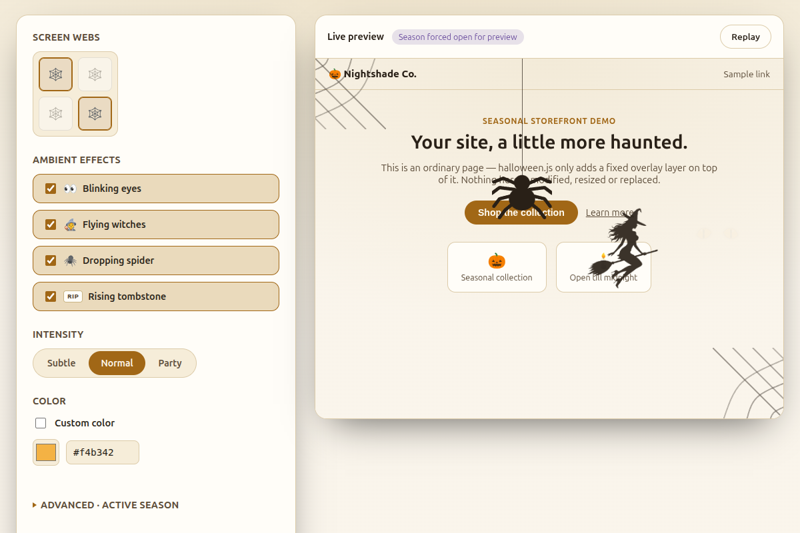

# 🎃 halloween.js

[](https://www.npmjs.com/package/halloween.js)
[](https://bundlejs.com/?q=halloween.js)
[](LICENSE)
[](https://www.npmjs.com/package/halloween.js)
[](https://www.jsdelivr.com/package/npm/halloween.js)
[](https://github.com/rogulia/halloween.js)

Zero-dependency Halloween screen-corner decorations and ambient page effects for any website.

[Live demo](https://halloween.js.org/)

Want to contribute? See [CONTRIBUTING.md](CONTRIBUTING.md).



## Install

```bash
npm install halloween.js
```

```js
import halloween, { pageEffects } from "halloween.js";
```

A plain `import` runs the library's auto-init side effect immediately — it starts watching `<body>` for the master `halloween` class as soon as the module loads, no separate init call needed. TypeScript types ship with the package.

For a no-build-step site (WordPress Theme Editor → header, any "custom HTML/scripts" plugin, plain HTML), a single script tag is still the simplest way to install it — no npm, no bundler, no separate CSS file, the script injects its own styles and auto-initializes the same way:

```html
<script src="https://cdn.jsdelivr.net/npm/halloween.js@1.0.3/dist/halloween.iife.js"></script>
```

After the script tag, the same imperative API is available as `Halloween.pageEffects.start("eyes")` etc. — see [Advanced: JS API](#advanced-js-api) below. Always pin an exact released version (like `@1.0.3` above) — jsDelivr caches an npm version forever, so it can never change under you.

### Platform guides

The same script tag works everywhere — only where you paste it, and how you set the `halloween` body class, changes per platform.

#### WordPress

- Without plugins: **Appearance → Theme Editor → header.php**, paste the script tag right before `</head>`. Only works on themes that allow file editing (not on WordPress.com's basic plan or block themes with editing disabled).
- With a "Insert Headers and Footers"-type plugin (any popular one works): paste the same script tag into its **Header** field, no theme editing needed.
- Add `class="halloween"` to `<body>` via your theme's body class filter, or add a small custom-HTML block with `<script>document.body.classList.add("halloween")</script>`.

```html
<script src="https://cdn.jsdelivr.net/npm/halloween.js@1.0.3/dist/halloween.iife.js"></script>
```

#### Webflow

- **Project Settings → Custom Code → Head Code** applies the script site-wide; use a specific page's **Page Settings → Custom Code** to scope it to one page instead.
- Webflow doesn't expose the `<body>` tag for editing directly — add the master class from the same Custom Code panel (Footer Code) instead:

```html
<script src="https://cdn.jsdelivr.net/npm/halloween.js@1.0.3/dist/halloween.iife.js"></script>
<script>document.body.classList.add("halloween");</script>
```

#### Shopify

- **Online Store → Themes → Edit Code → theme.liquid**, paste the script tag right before `</head>`.
- Shopify's `theme.liquid` gives you the `<body>` tag directly, so add the class there:

```html
<body class="halloween">
```

```html
<script src="https://cdn.jsdelivr.net/npm/halloween.js@1.0.3/dist/halloween.iife.js"></script>
```

#### Squarespace

- **Settings → Advanced → Code Injection → Header**, paste the script tag. Code Injection only exposes header/footer, not `<body>` itself.
- Add the master class from the same Header field instead:

```html
<script src="https://cdn.jsdelivr.net/npm/halloween.js@1.0.3/dist/halloween.iife.js"></script>
<script>document.body.classList.add("halloween");</script>
```

## The master switch

`<body class="halloween">` turns the library on. Without it, nothing runs at all — no ambient effects, no screen corners. This is deliberate: one class to flip, everywhere else just uses modifiers. Additional body classes (below) opt in to specific ambient effects and screen corners; the library automatically re-syncs itself whenever `<body>`'s classes change, so toggling any of these classes from your own code is enough — no JS call required.

```html
<body class="halloween">
```

## Page-level: ambient effects

Add any of these on `<body>`, alongside the master `halloween` class — no JS call needed, the library watches for it. Removing a class clears any effect currently on screen immediately, it doesn't wait for it to finish its own fade-out.

```html
<body class="halloween halloween-eyes halloween-witches halloween-spider-drop halloween-tombstones halloween-screen-left-top">
  <!-- blinking eyes fade in and out at random spots; witches fly across the screen at an angle;
       a spider drops from the top at a random horizontal spot and climbs back up;
       a tombstone rises out of the ground at a random horizontal spot, holds, then sinks back;
       a spider web sits fixed in the top-left corner of the viewport -->
</body>
```

| Class                                                                                              | Effect                                                     |
| ---------------------------------------------------------------------------------------------------- | ----------------------------------------------------------- |
| `halloween-eyes`                                                                                       | Blinking eyes fade in/out at random spots                   |
| `halloween-witches`                                                                                     | Witches fly across at a random angle and direction           |
| `halloween-spider-drop`                                                                                 | A spider drops from the top to 75% of viewport height, then climbs back up, at a random horizontal position each time |
| `halloween-tombstones`                                                                                  | A tombstone rises ~80–120px out of a random horizontal spot at the bottom of the viewport, holds briefly, then sinks back down |
| `halloween-screen-left-top` / `halloween-screen-right-top` / `halloween-screen-left-bottom` / `halloween-screen-right-bottom` | A static spider web fixed to that viewport corner — any combination |

Or toggle it from JS, e.g. for SPA routing:

```js
document.body.classList.toggle("halloween-eyes", someCondition);
```

At most one instance of each ambient effect (eyes, witches, spider-drop, tombstones) is on screen at a time (more with `halloween-intensity-party`, see below). While the tab is in the background, no new ambient nodes are created — the scheduler keeps running and resumes on the next scheduled tick after the tab becomes visible.

### Intensity presets

Add one intensity class alongside the effect classes to control spawn rate, max concurrent nodes, size and page-layer opacity. Use only one at a time — if more than one ends up on `<body>`, `halloween-intensity-party` wins over `halloween-intensity-subtle`. No class at all means `normal`.

| Class                     | Spawn delay  | Max concurrent per effect | Size    | Page opacity |
| ------------------------- | ------------ | -------------------------- | ------- | ------------ |
| `halloween-intensity-subtle` | 2.5x slower  | 1                           | ~75%    | 0.65         |
| `halloween-intensity-normal` (default) | 1x | 1                           | 100%    | 1            |
| `halloween-intensity-party`  | 2x faster    | 2                           | ~115%   | 1            |

```html
<body class="halloween halloween-witches halloween-intensity-subtle">
<body class="halloween halloween-eyes halloween-spider-drop halloween-intensity-party">
```

## Season window

Leave the script in the page year-round — by default it only does anything within a ~2 week window around Halloween (18 Oct – 2 Nov). Override it with `data-halloween-start`/`data-halloween-end` attributes on `<body>` — this works exactly the same way whether you're using the script tag or the npm package:

```html
<body
  class="halloween halloween-eyes halloween-screen-left-top"
  data-halloween-start="18-10"
  data-halloween-end="02-11"
>
```

| Attribute               | Meaning              | Default  |
| ------------------------ | --------------------- | -------- |
| `data-halloween-start`  | Season start, `DD-MM` | `18-10`  |
| `data-halloween-end`    | Season end, `DD-MM`   | `02-11`  |

Both attributes are optional and resolved independently — set only the one you need to change, or leave both off entirely to use the default window. Changing either one at runtime (e.g. from your own script) triggers an immediate re-sync, the same as changing the `halloween`/effect classes does.

Outside the season window, the master switch stays off entirely — same as if `halloween` weren't on `<body>` at all. A non-empty but malformed value fails open (runs as if there were no season restriction) rather than silently disabling the library; an empty or whitespace-only attribute is treated as not set. Values are validated against the real calendar (`31-04` and the like are rejected); `29-02` is accepted year-round and resolves to 28 Feb in non-leap years — this doesn't change based on where the value came from.

### Classic-script query param shorthand

If you're using the plain script tag, `?s=DD-MM&e=DD-MM` on the script's own `src` is also supported, as a shorthand:

```html
<script
  src="https://cdn.jsdelivr.net/npm/halloween.js@1.0.3/dist/halloween.iife.js?s=18-10&e=02-11"
></script>
```

This only works for the classic script tag — there's no script URL for the npm import to read query params from. When a `<body>` attribute and a query param disagree, the attribute wins:

**`data-halloween-start`/`data-halloween-end` attribute → script `?s=`/`?e=` query param → library default**

(Each end of the window follows this precedence independently — setting only `data-halloween-start` still lets `?e=` or the default apply to the end.)

## Color

Spiders, threads, webs and the witch silhouette all read `color: var(--halloween-color, currentColor)`, so by default they inherit whatever text color the page already has — usually the right call on both light and dark sites without any configuration. Eyes keep their own fixed amber, since they're a two-tone illustration, not a single-color decoration.

`--halloween-color` is the universal way to override it, and works the same for the script tag and the npm package:

```css
:root {
  --halloween-color: #ff6b00;
}
```

If you're using the plain script tag, `?color=` on the script's own `src` (URL-encoded, e.g. `?color=%23ff6b00`) is also supported as a classic-script convenience — there's no equivalent for the npm import.

Ambient effects render in a fixed full-page layer at `z-index: var(--halloween-page-z-index, 999)`, so it can be pushed below a modal or cookie banner if needed:

```css
:root {
  --halloween-page-z-index: 500;
}
```

## Sizing & opacity

Each ambient effect's box size can be overridden independently via CSS custom properties, and the whole effects layer can be dimmed as a unit. Like `--halloween-color` above, a value you set here always wins over whatever the active `halloween-intensity-*` preset would otherwise use.

| Property | Controls | Default |
| --- | --- | --- |
| `--halloween-eyes-width` / `--halloween-eyes-height` | Size of the blinking-eyes decoration | `64px` / `26px` |
| `--halloween-witch-width` / `--halloween-witch-height` | Size of the flying witch | `104px` / `130px` |
| `--halloween-spider-drop-width` / `--halloween-spider-drop-height` | Size of the dropping spider | `90px` / `90px` |
| `--halloween-tombstone-width` / `--halloween-tombstone-height` | Size of the rising tombstone | `76px` / `96px` |
| `--halloween-screen-corner-size` | Width and height of each screen-corner web (square) | `120px` |
| `--halloween-page-opacity` | Opacity of the whole effects layer (ambient nodes and screen corners together) | `1` |

## Advanced: JS API

The library already auto-syncs itself against `<body>`'s classes (on load, and on every class change), so most sites never need to call anything directly. These two exports are for the cases where that's not enough. If you're using the plain script tag, the same functions are available as `Halloween.halloween` and `Halloween.pageEffects`.

**`halloween()`** — an optional, immediate manual sync against `<body>`'s current classes and the season gate. Takes no arguments. It re-evaluates the same master-switch/season-gate check the automatic sync does — it does not bypass either — so it's useful for syncing sooner than the next automatic check, not for skipping the checks themselves.

```js
import halloween from "halloween.js";

document.body.classList.add("halloween", "halloween-eyes"); // master class required
halloween(); // sync now, instead of waiting for the next automatic check
```

**`pageEffects.start(name)` / `pageEffects.stop(name)`** — low-level, direct control over one ambient effect (`"eyes" | "witches" | "spider-drop" | "tombstones"`), bypassing the class-driven system entirely.

```js
import { pageEffects } from "halloween.js";

pageEffects.start("eyes");
pageEffects.stop("witches");
```

## Accessibility

Every animation respects `prefers-reduced-motion: reduce`, and picks up live changes to it while the page stays open — no reload needed:

- Ambient effects (eyes, witches, spider-drop, tombstones) don't spawn; any already on screen are removed immediately once the preference turns on.
- Static screen-corner webs are unaffected — they're not animated to begin with.

All decorative SVGs are `aria-hidden`.

## Bundle

Single IIFE build (styles included) for drop-in use, plus ESM/CJS builds and TypeScript types (`dist/halloween.d.ts` for ESM, `dist/halloween.d.cts` for CJS) for npm/bundler consumers. Under 10 KB gzipped, zero runtime dependencies.

## Local development

```bash
npm install
npm run dev           # tsup --watch
npm run demo:prepare  # build + copy dist into demo/dist for the local demo page
```

Serve `demo/` with any static file server (opening `index.html` directly via `file://` won't work — module/script loading is blocked by the browser's CORS policy for local files).

## License

MIT © [Iurii Rogulia](https://iurii.rogulia.fi)
